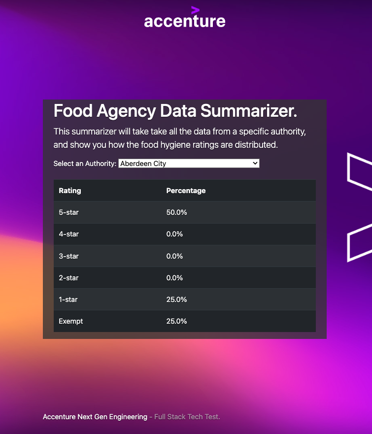

# Aviva Zero - Full Stack Tech Test (Go)

## Prerequisites

* Go 1.12
* Access to the internet
* Suitable development environment

## Getting Started

* Build: `make build`
* Run: `make run`
* Test: `make test`
* View: `make run` then navigate to http://localhost:8080

## Submission

* Please do not fork this repository.
* Please do not commit your code to GitHub.
* Send us your code, zipped up, as per the instructions in email we sent.